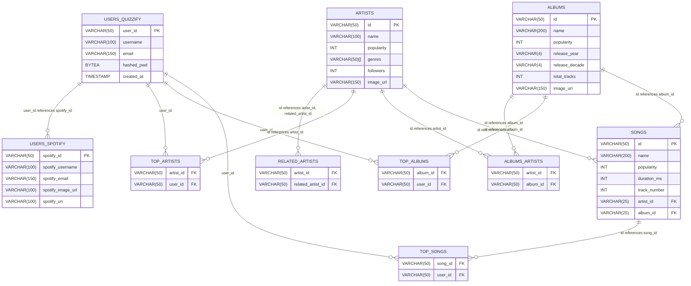

# [WIP] Quizzify :musical_score:

Are you a music expert? Quizzify will challenge your musical knowledge. Quizzify invites music enthusiasts to test their expertise! Delve into a challenging and fun quiz experience designed to push your musical knowledge to the limit.

## :round_pushpin: Quick start

### Installation

To install the project, you need to clone the repository. It is recommended to create a virtual environment.

```bash
git clone git@github.com:alannadevgen/quizzify.git
cd quizzify
```

### Local setup

The following instructions will guide you through the setup of the project on your local machine.

1. Set the environment variables in an `.env` file in the root directory of the project. The `.env` file should contain the following variables:

```bash
SPOTIFY_CLIENT_ID=<YOUR SPOTIFY CLIENT ID>  # TBD
SPOTIFY_CLIENT_SECRET=<YOUR SPOTIFY CLIENT SECRET>  # TBD
SPOTIFY_REDIRECT_URI=<YOUR REDIRECT URI AS DEFINED IN YOUR SPOTIFY DASHBOARD APP> # TBD
SPOTIFY_AUTH_URL=https://accounts.spotify.com/authorize
SPOTIFY_TOKEN_URL=https://accounts.spotify.com/api/token
SPOTIFY_AUTH_SCOPE="LIST OF SCOPES TO DEFINE"  # TBD
```

2. Pre-commit hooks:

Pre-commit hooks have been defined to ensure a good code quality. To enable these pre-commit hooks, the following commands should be executed.

```bash
# install pre-commit
pip3 install pre-commit
# set up the git hook scripts
pre-commit install 
```

3. Build & run the docker image for the API.

a. Build & run the docker image using Docker.

````bash
docker build -t quizzify .
docker run -it --rm --name quizzify -p 8000:8000 quizzify
````

b. Build & run the docker image using Docker compose.

The following commands build the images and then run the containers.

````bash
docker-compose build
docker-compose up quizzify-api
````

It is also possible to build and run the containers in one command.

````bash
docker-compose up quizzify-api --build
````

To stop the containers, you can use the following commands. The tag `-v` removes the volumes that are associated with the containers.

````bash
docker-compose down
docker-compose down -v
````
You can now access the API at http://localhost:8000.

## Architecture

TBD




## Contributors :woman_technologist:

<a href="https://github.com/alannadevgen/quizzify/graphs/contributors">
  
</a>